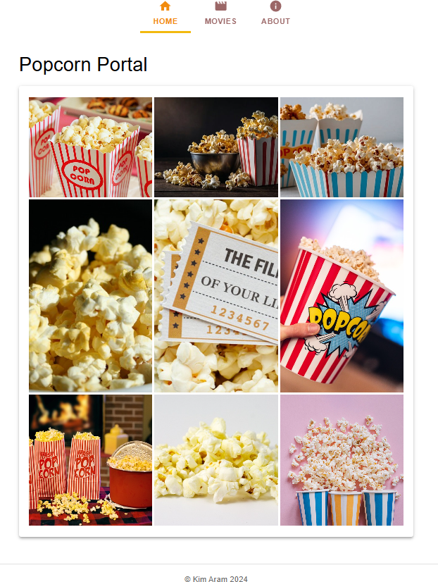
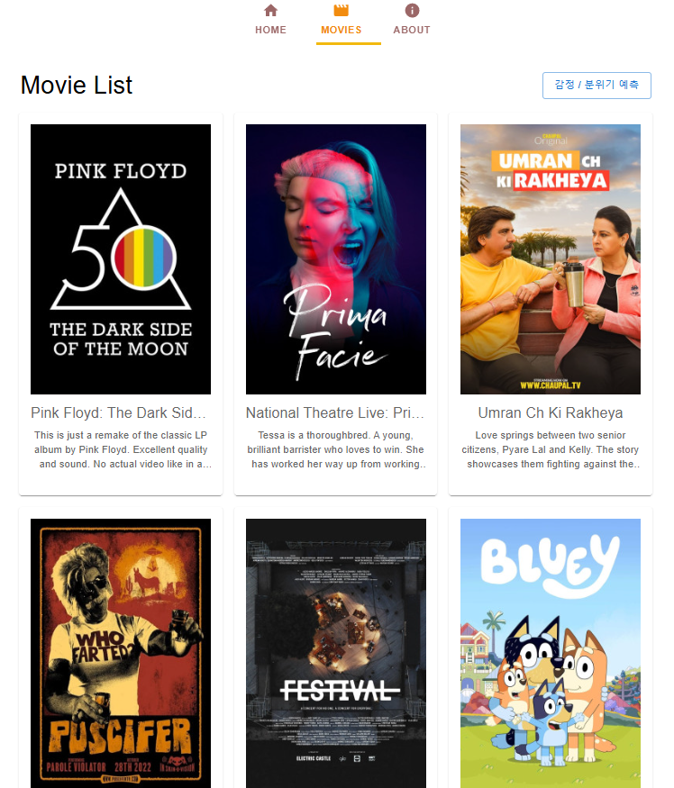
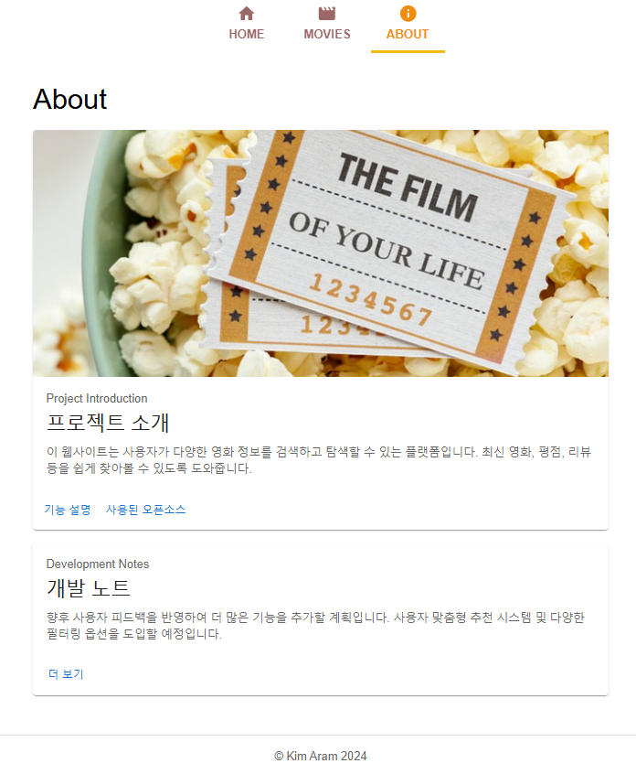
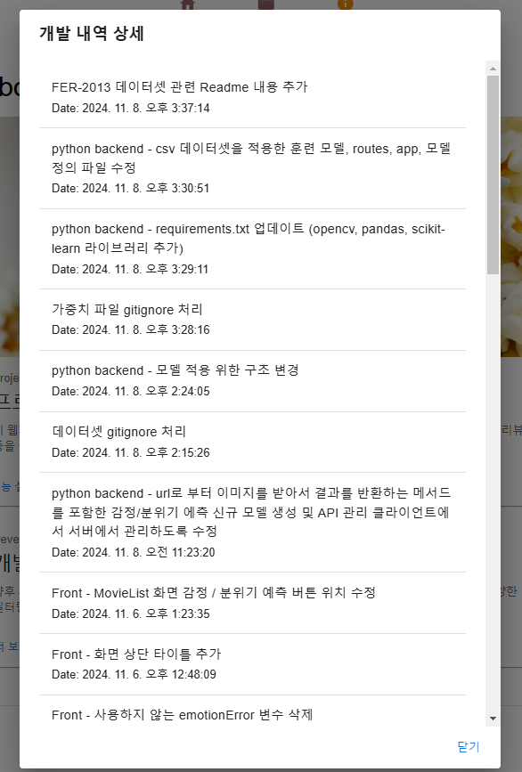

# Popcorn Portal : AI 기반 감정 분석과 영화 정보 제공 플랫폼

### 프로젝트 소개

이 프로젝트는 영화 정보 제공과 함께 영화 포스터의 감정/분위기를 예측하는 시스템을 구축한 영화 웹 애플리케이션입니다.
이를 위해 영화 정보 API와 TensorFlow를 사용하여 딥러닝 모델을 적용하였으며, 영화별 분위기를 사용자에게 시각적으로 전달할 수 있도록 설계되었습니다.

### 기능 목록

- **영화 목록 조회**: 영화 목록을 제공하고 각 영화의 정보(제목, 줄거리, 포스터)를 표시합니다.
- **감정/분위기 예측**: 포스터 이미지를 분석하여 해당 영화의 감정이나 분위기를 예측하여 시각화된 결과를 제공합니다.
- **GitHub 커밋 내역 조회**: 특정 GitHub 저장소의 커밋 기록을 불러와 프로젝트의 최신 업데이트를 확인할 수 있습니다.

### 스크린샷

- main 화면
  </img><br/>

- 영화 리스트 화면
  </img><br/>

- About 화면
  </img><br/>

- About -> 개발 노트 더보기 팝업창 화면
  </img><br/>

### 설치 및 실행 방법

이 프로젝트는 **React**와 **Python - TensorFlow** 기반으로 구성되어 있습니다.

1. 백엔드(Flask & TensorFlow) 설정

- 프로젝트 디렉토리에서 가상환경을 설정하고 활성화합니다.

```bash
python -m venv venv # 가상환경 생성
source venv/Scripts/activate # 가상환경 활성화
```

- 필요한 Python 패키지를 설치합니다.

```bash
pip install -r requirements.txt
```

- Flask 서버를 실행합니다.

```bash
python app.py
```

서버가 정상적으로 실행되면 _http://localhost:5000_ 에서 API를 확인할 수 있습니다.

2. 프론트엔드 실행 (React)

- React 앱 디렉토리에서 패키지를 설치합니다.

```bash
npm install
```

- React 개발 서버를 시작합니다.

```bash
npm start
```

브라우저에서 *http://localhost:3000*으로 이동하여 프론트엔드를 확인할 수 있습니다.

### 기술 스택 및 오픈소스

아래는 사용된 주요 오픈소스와 데이터셋입니다.

- FER-2013 데이터셋

  - URL : https://www.kaggle.com/datasets/deadskull7/fer2013#fer2013.csv
  - 설명 : 얼굴 이미지에서 감정을 인식하기 위해 사용되는 표준 데이터셋으로 Kaggle에서 제공하며, 48x48 크기의 흑백 이미지와 7개의 감정 클래스(Angry, Disgust, Fear, Happy, Sad, Surprise, Neutral)로 구성되어 있다. 감정 분석, 컴퓨터 비전 및 딥러닝 모델 훈련에 널리 활용된다.
  - 사용법
    1.  Kaggle에서 fer2013.csv 파일을 다운로드하고, 모델 훈련을 위한 프로젝트 디렉토리에 저장
    2.  pandas를 사용해 데이터를 로드한 후, pixels 열을 통해 이미지를 배열 형태로 변환하고, emotion 열을 통해 라벨 부여
    3.  전처리된 데이터를 train_test_split으로 학습/검증 세트로 분리하고, 딥러닝 모델에 입력해 학습한다.

- TensorFlow

  - URL : https://www.tensorflow.org
  - 설명 : 오픈 소스 머신러닝 프레임워크로, 다양한 머신러닝 및 딥러닝 모델을 구축하고 훈련시키는 데 사용된다. 특히 대규모 데이터셋을 처리하고, 복잡한 수치 연산을 효율적으로 수행할 수 있는 기능을 제공한다.
  - 사용법 : pip를 사용하여 설치할 수 있으며, pip install tensorflow 명령어로 설치 후, 필요한 모듈을 임포트하여 모델을 구성하고 훈련할 수 있다.

- Flask

  - URL: https://flask.palletsprojects.com/
  - 설명: Flask는 파이썬으로 작성된 경량 웹 프레임워크로, 웹 애플리케이션과 RESTful API를 쉽게 개발할 수 있도록 도와준다. 간단한 구조로 빠른 개발이 가능하며, 필요에 따라 다양한 확장 기능을 추가할 수 있다.
  - 사용법: pip install Flask 명령어로 Flask를 설치한 후, 기본적인 Flask 애플리케이션을 생성하고 라우트를 설정하여 사용할 수 있다.

- Create React App

  - URL : https://github.com/facebook/create-react-app
  - 설명 : React 애플리케이션을 손쉽게 설정할 수 있도록 도와주는 기본 템플릿 생성 도구로 복잡한 설정 없이 빠르게 개발을 시작할 수 있다.
  - 사용법 : cmd에서 npx create-react-app my-app 실행하여 기본 템플릿 생성

- React Router

  - URL : https://github.com/remix-run/react-router
  - 설명 : SPA(Single Page Application)에서 페이지 간의 탐색을 관리하는 라이브러리
  - 사용법
    1.  npm install react-router-dom으로 설치
    2.  BrowserRouter, Router 컴포넌트를 사용하여 라우팅 설정

- Redux

  - URL : https://github.com/reduxjs/redux
  - 설명 : 애플리케이션의 상태 관리를 도와주는 라이브러리
  - 사용법
    1.  npm install npm install @reduxjs/toolkit react-redux로 설치
    2.  중앙에서 상태를 관리할 수 있는 스토어 설정

- Material-UI

  - URL : https://mui.com/material-ui/material-icons/?query=abou
  - 설명 : Google의 Material Desingn을 기반으로 한 React UI 프레임워크
  - 사용법
    1.  npm install @mui/material @emotion/react @emaotion/styed, @mui/icons-material
    2.  컴포넌트를 불러와 사용

- Axios

  - URL : https://github.com/axios/axios
  - 설명 : HTTP 요청을 간편하게 처리할 수 있는 라이브러리로 API 통신에 유용하다.
  - 사용법
    1.  npm install axios로 설치
    2.  API 호출을 통해 데이터 가져오기

- 데이터 API

  - URL : https://yts.mx/api#list_movies
  - 설명 : 영화 데이터 API
    <br>
  - URL : https://api.github.com/repos/{유저명}/{저장소명}/commits
  - 설명 : Github 특정 저장소의 커밋역 불러오는 API

### 구조 및 설계

<div style="border:1px solid #ddd; padding: 16px; border-radius: 8px; background-color: #f9f9f9;">

```plaintext
popcorn-portal/
├── node_modules/
├── public/
└── src/
    ├── components/
    │   ├── dialogs/
    │   │   ├── CustomDialog.js          # 사용자 정의 다이얼로그 컴포넌트
    │   │   ├── FeatureDialog.js          # 기능 설명을 위한 다이얼로그
    │   │   ├── MoreInfoDialog.js         # 추가 정보 제공 다이얼로그
    │   │   └── OpenSourceDialog.js       # 오픈소스 관련 다이얼로그
    │   ├── About.js                      # 소개 페이지 컴포넌트
    │   ├── Footer.js                     # 페이지 하단의 Footer 컴포넌트
    │   ├── Home.js                       # 홈 페이지 컴포넌트
    │   ├── MovieList.js                  # 영화 목록을 렌더링하는 컴포넌트
    │   ├── Movies.js                     # 영화 정보 관리 컴포넌트
    │   ├── Navigation.js                 # 네비게이션 바 컴포넌트
    │   └── slices/
    │       ├── commitSlice.js            # GitHub 커밋 데이터 관리 Redux Slice
    │       └── movieSlice.js             # 영화 데이터 관리 Redux Slice
    ├── App.js                            # 메인 App 컴포넌트
    ├── index.js                          # React 엔트리 파일
    └── store.js                          # Redux 스토어 설정

server/
├── dataset/
│   └── fer2013.csv                       # 감정 예측을 위한 데이터셋
├── models/
│   ├── __init__.py                       # 모델 초기화 파일
│   ├── emotionModel_weights.h5           # 감정 예측 모델 가중치 파일
│   ├── emotionModel.py                   # 감정 예측 모델 파일
│   ├── emotionOutputModel.py             # 예측 결과 출력 모델
├── routes/
│    ├── __init__.py                      # 라우트 초기화 파일
│    └── movieRoutes.py                   # 영화 관련 API 라우트
├── train/
│    └── train_emotion_model.py           # 감정 예측 모델 훈련 파일
├── app.py                                # Flask 서버 실행
├── config.py                             # 경로 지정 파일
└── requirements.txt                      # 패키지 파일
```

</div>

### 향후 개선 사항

- UI 정리 : UI 디자인을 개선하여 사용자 경험 향상
- 필터 기능 : 영화 장르, 감정 등의 필터를 추가해 검색 최적화
- 검색 기능 : 사용자들이 영화를 검색할 수 있도록 검색 기능 추가
